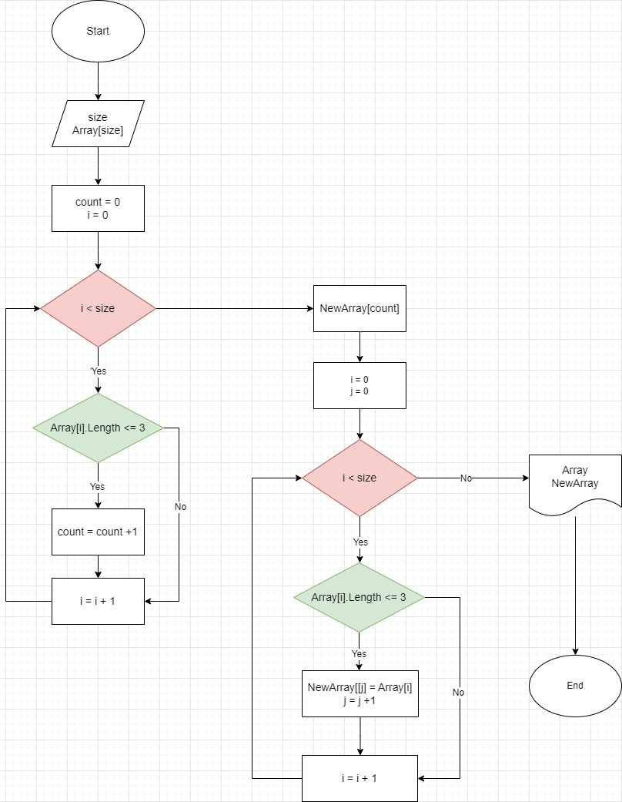

# Задача

### Написать программу, которая из имеющегося массива строк формирует новый массив из строк, длина которых меньше, либо равна 3 символам. 

## Описание решения задачи
1. **`Составление блок - схемы`**

Для решения задачи необходимо составить блок-схему алгоритма:

2. **`Методы решеия задачи`**

При написании программы, решающую поставленную задачу, используем методы:

* InputNum

Ввод от пользователя с клавиатуры длины массива и возвращаем преобразованное целочисленное значение.
* EnterString

Ввод от пользователя элементов массива. Функция возвращает строку введенную пользователем.
* CreateArray

Создание первоначального массива, размер которого равен длине введенной пользователем. Возвращаем это массив.
* FillArray

Данный метод заполняет элементами первоначальный массив, использую данные введенные пользователем.
* NewStringArray

Метод описывает создание и заполнение нового массива. Сначало опредляем размер нового массива, для этого проходимся по первоначальному массиву и считаем элементы удовлетворяющие условию (длина меньше, либо равна 3 символам).  
Далее заполняем новый массив, для этого снова проходимся по исходному массиву и ищем элементы удовлетворяющие условию (длина меньше, либо равна 3 символам) и возвращаем наш новый массив.
* PrintArray

Метод печати массивов.